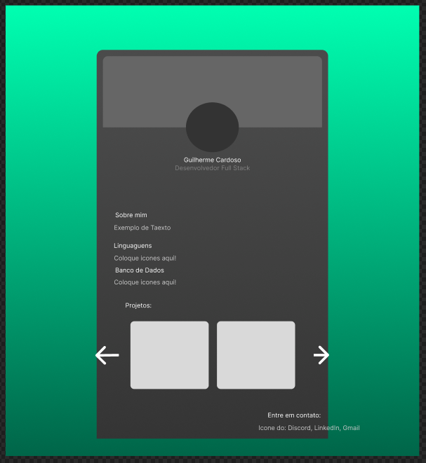

# ⚡ Cardoso Developer Portfolio


> **Documentación en otros idiomas:**
> 
> [🇺🇸 English](../../README.md) | [🇧🇷 Português](./pt-BR.md) | [🇫🇷 Français](./fr-FR.md)

---

### 🚀 Introducción y Trasfondo
Este proyecto es mi portafolio personal y representa un paso decisivo en mi camino para convertirme en un **desarrollador Full-Stack**.

Mi enfoque principal en los últimos tiempos ha estado centrado en la ingeniería de backend, especialmente con **Java**. Hacía varios meses que no programaba en TypeScript, por lo que estaba un poco "oxidado". A pesar de ello, decidí afrontar el ecosistema de **Angular** moderno y construir esta aplicación desde cero en un sprint intensivo de **un solo día**. La experiencia demostró la robustez del framework: una productividad y organización muy superiores a cualquier desarrollo con HTML/CSS puro.

---

### 🎨 Del Concepto en Figma al Código
Considero que el desarrollo de software comienza con una planificación visual y estructural deliberada antes de escribir la primera línea de código:

1. **Boceto Visual en Figma:** Diseñé todo el layout base, espaciados y jerarquía visual directamente en **Figma** (estructura del banner, distribución de las tarjetas, carrusel y sección de contacto).
2. **IA como Acelerador de Desarrollo:** En lugar de pedirle a la IA que inventara interfaces genéricas, la utilicé estrictamente como copiloto técnico para trasladar con agilidad el concepto exacto que ya había diseñado en Figma hacia los componentes de Angular.
3. **Ingeniería y Refinamiento:** La gestión reactiva del estado, los contratos de TypeScript, la arquitectura de internacionalización (i18n) y los tokens de diseño CSS fueron arquitectados y ajustados manualmente.

<p align="center">
  
  <br>
  <em>Concepto inicial prototipado en Figma antes de comenzar la implementación.</em>
</p>

---

### 🎯 Características de Angular Moderno (v17+)
En lugar de depender de la arquitectura tradicional basada en `NgModule`, el proyecto implementa patrones contemporáneos:
* **Signals y Reactividad Granular:** Control del selector de tema (*dark/light*), estado de los menús desplegables y datos de idioma mediante primitivas reactivas (`signal`, `computed`, `input.required`) con cero sobrecarga de ciclo de detección.
* **Componentes Standalone:** Arquitectura modular y ligera, eliminando ceremonias heredadas.
* **Tipado Estricto con TypeScript:** Interfaces y DTOs bien delimitados para habilidades, proyectos y enlaces sociales.
* **i18n Reactivo y Tematización:** Cambio dinámico de idioma (`pt-BR`, `en-US`, `es-ES`, `fr-FR`) y alternancia de temas visuales sin recargas de página ni repintados innecesarios del DOM.

---

### 📂 Estructura del Proyecto
```text
cardoso-portfolio
├─ docs
│  ├─ assets                 # Demostraciones y conceptos de Figma
│  └─ locales                # Documentación en múltiples idiomas
├─ public                    # Imágenes de perfil y recursos estáticos
├─ src
│  ├─ app
│  │  ├─ app.config.ts       # Configuración del bootstrap standalone
│  │  ├─ app.ts              # Componente raíz de la aplicación
│  │  └─ modules
│  │     ├─ constants        # Diccionarios de traducción (i18n)
│  │     ├─ models           # DTOs e interfaces de datos estrictas
│  │     ├─ screens
│  │     │  └─ portfolio     # Componente de la pantalla del portafolio
│  │     └─ services         # Gestor de estado reactivo (StorageService)
│  ├─ assets
│  │  └─ profile.json        # Datos estructurados del portafolio
│  ├─ styles.scss            # Variables de diseño y estilos globales
│  └─ main.ts                # Punto de entrada de la aplicación
├─ angular.json              # Configuraciones de compilación de Angular CLI
├─ README.md                 # Documentación técnica principal
└─ tsconfig.json             # Opciones estrictas del compilador TS
```

---

### 🛠️ Instalación y Ejecución Local
```
# Clonar el repositorio
git clone https://github.com/guilhermeCardosooo/cardoso-portfolio.git

# Instalar dependencias
npm install

# Iniciar el servidor local de desarrollo
npm start
# o
ng serve
```
Abre http://localhost:4200/ en tu navegador.

---

### 📜 Licencia
Proyecto personal desarrollado con fines educativos, consolidación técnica y presentación profesional.